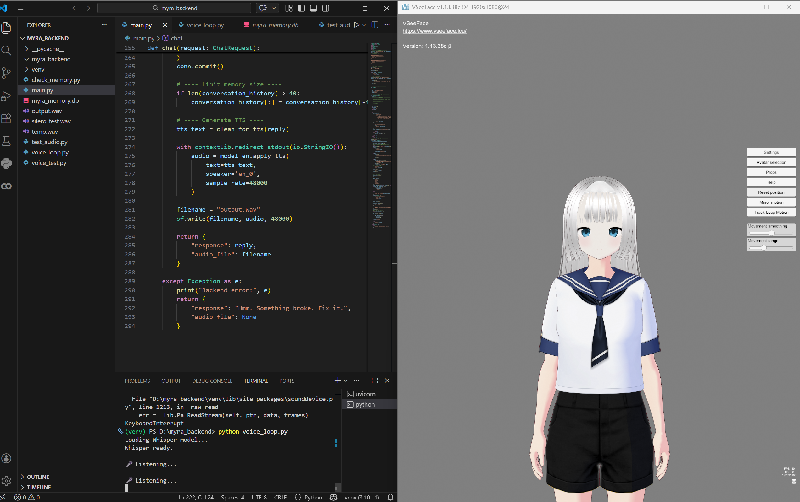

# MYRA - AI Voice Assistant

Myra is an AI voice assistant capable of voice interaction, memory storage, and emotional responses through a virtual avatar.

## Demo

## Features
- Voice conversation
- Memory storage using SQLite
- Speech-to-Text
- Text-to-Speech
- Avatar interaction

## Tech Stack
- Python
- FastAPI
- SQLite
- PyTorch
- Silero TTS
- VRoid Studio
- VSeeFace

## How It Works
1. User speaks
2. Speech converted to text
3. AI generates response
4. Response converted to speech
5. Avatar reacts

## Run the Project

Install dependencies

pip install -r requirements.txt

Run

python main.py
