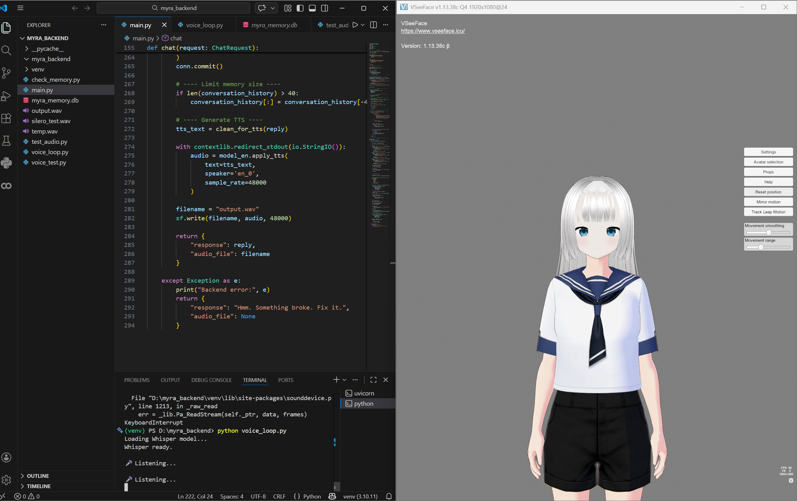

# 🎀 MYRA - Interactive 3D AI Waifu Companion

Myra is an interactive, sweet-voiced, and expressive AI waifu companion capable of live voice banter, visual perception through your webcam, continuous memory, and emotional facial expressions mapped to a 3D avatar in **VSeeFace**.

---

## 📸 Demo



---

## ✨ Features

- **🧠 Expressive Waifu Soul**:
  - Playfully smug, witty, and sweet-voiced personality.
  - Shy and flustered when complimented; demanding when ignored.
  - **Tsundere Task Execution**: Playfully complains (*"Ugh, what a drag..."*), but faithfully executes and presents files/PPTs.
  - **Organic Conversation**: Delivers quick 1–2 line banters or expands naturally to 4–6 sentences for in-depth queries.

- **🎀 Sweet Anime Voice Engine**:
  - Powered by `edge-tts` with high-quality, expressive anime voice profiles (`en-US-AnaNeural`).
  - Automatic bilingual detection for Hindi/Hinglish (`hi-IN-SwaraNeural`).
  - Fallback to Silero TTS (`v3_en`) when offline.

- **🎭 Live 3D Avatar & Facial Sync (VSeeFace VMC OSC)**:
  - Real-time blendshape emotion mapping (`[EMOTE: smug]`, `[EMOTE: blush]`, `[EMOTE: smile]`, `[EMOTE: pout]`, `[EMOTE: surprised]`, `[EMOTE: angry]`).
  - Audio lip-sync through VSeeFace.

- **👁️ Fast Vision & Social Intelligence**:
  - **Zero-Delay Object Perception**: Real-time YOLOv8 object tracking (`keyboard`, `cell phone`, `cup`, `bottle`, `laptop`) fed directly to her brain.
  - **Girlfriend Jealousy Tease**: Playfully reacts when a new female face (ages 18–28) is in frame (*"Wait... who is she, Mallu? Is she your girlfriend? 🤭"*).
  - **Crowd Awareness**: Detects 3+ people lingering for > 2 minutes and prompts to be introduced.
  - **Friend Learning (`/learn_face`)**: Saves friends' names and faces to remember them.

- **💾 Continuous Memory (SQLite)**:
  - Sliding-window context retrieval (last 8 conversation turns) so she remembers past exchanges.

- **⚡ In-Memory Low-Latency Voice Loop**:
  - Streamlined `faster-whisper` voice loop running directly in RAM (zero disk I/O lag).

---

## 🛠️ Tech Stack

- **AI Brain**: Ollama (LLaMA 3 / Myra Modelfile)
- **Speech-to-Text (STT)**: Faster-Whisper (In-Memory Float32)
- **Text-to-Speech (TTS)**: Edge-TTS (`en-US-AnaNeural` / `hi-IN-SwaraNeural`) & Silero TTS
- **Computer Vision**: OpenCV, Ultralytics YOLOv8, DeepFace
- **3D Avatar & Tracking**: VRoid Studio, VSeeFace, Python-OSC (VMC Protocol)
- **Backend & Database**: FastAPI, Uvicorn, SQLite3, Python-PPTX

---

## 🚀 Getting Started

### 1. Prerequisites
- **Python 3.10+**
- **Ollama** installed with `llama3` or `myra`:
  ```bash
  ollama run llama3
  ```
- **VSeeFace** running with your VRoid avatar (Enable **VMC Protocol** receiver on port `39539`).

### 2. Install Dependencies
```bash
pip install -r requirements.txt
```

### 3. Run the Backend Server
```bash
python main.py
```

### 4. Start the Voice Interaction Loop
Open a second terminal and run:
```bash
python voice_loop.py
```

---

## 💬 How to Interact
- Say **"Myra"** to wake her up!
- Try holding objects: *"Myra, what am I holding?"*
- Compliment her: *"Myra, you look really cute today!"* (Watch her blush!).
- Give her a task: *"Myra, present the PPT in this folder."*
